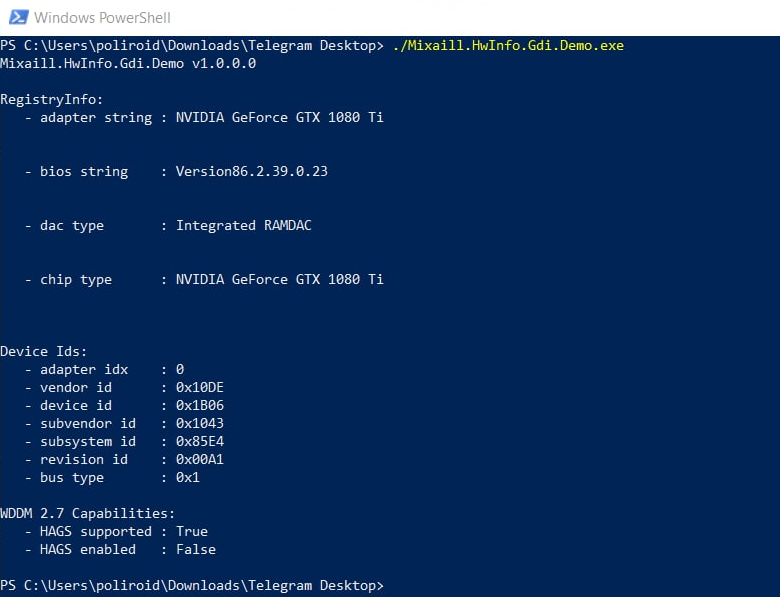
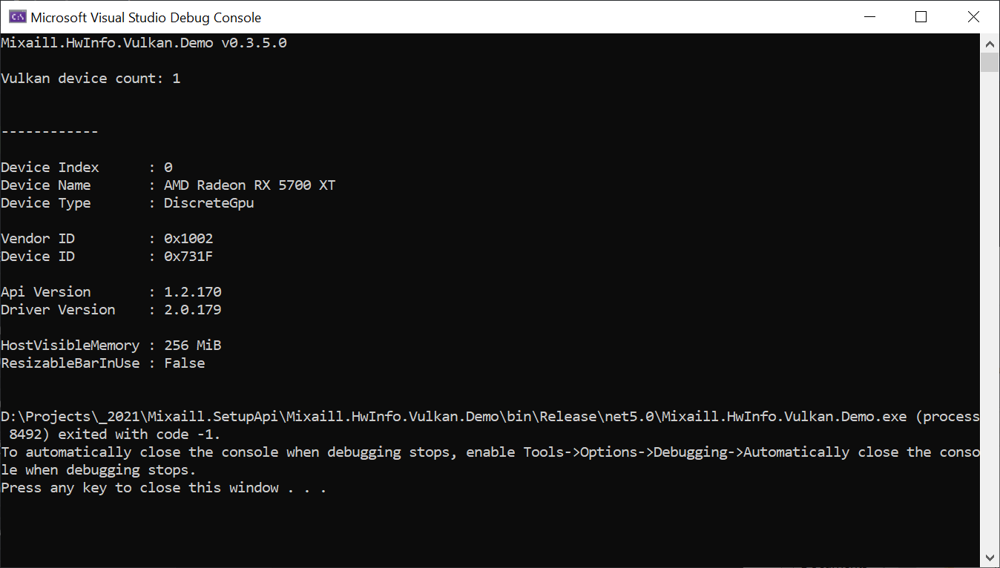

# Mixaill.HwInfo

A set of small libraries which helps to get advanced info about hardware

Download demo: https://github.com/Mixaill/Mixaill.SetupApi/releases

## Mixaill.HwInfo.D3DKMT

Gives access to some info like HAGS status via D3DKMT_ functions

## Mixaill.HwInfo.Vulkan

Receives info about GPU memory aperture size

## Mixaill.HwInfo.SetupApi

A little wrapper for Windows SetupAPI for .NET which gives info about PCI BAR allocation

